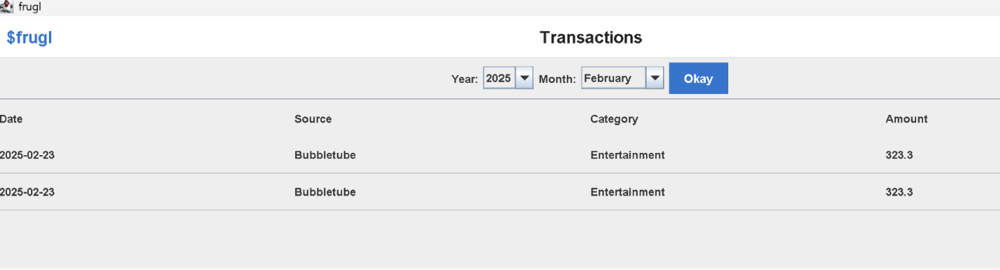
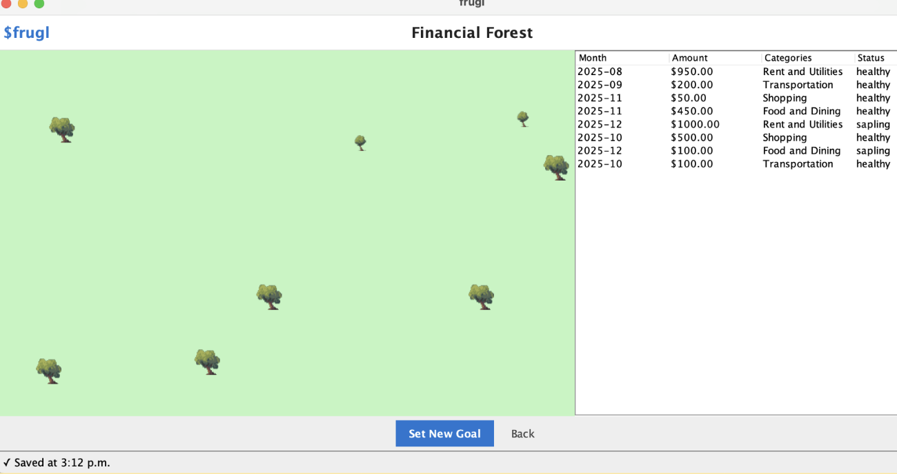
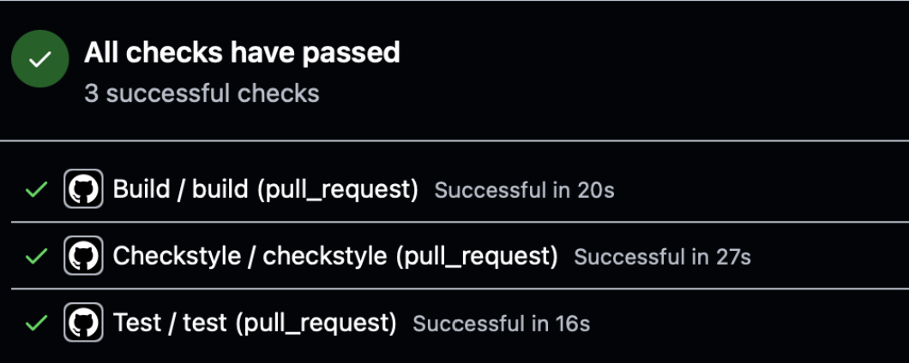

# frugl - Personal Finance Application

This app was designed as part of a group project for CSC207: Software Design in Fall 2025. The original repo is hosted here: https://github.com/GaminRick7/frugl.

## Project Summary

Frugl is a swing-based Personal Financial Management application that transforms raw bank statements into actionable insight. It simplifies financial tracking by allowing users to import bank statements for automated categorization and autosaving. The app promotes mindful spending through intuitive visualizations and a gamified system for setting and tracking monthly spending goals.

The user navigates the app from the main dashboard, where they can import bank statements from their local files and select a date range to visualize a breakdown of spending, inflows, and outflows. The user can also view monthly individual transactions and set goals using an interactive “financial forest,” where each goal creates a tree in their goal forest.

### Structure of the App
The application is built on Clean Architecture and SOLID principles, with excellent Code Quality. Our front-end UI elements operate independently of our core back-end logic, improving maintainability and collaboration. Our app runs locally, processes bank statements from JSON files using Gemini API, and displays colourful charts via the QuickChart.io API.

## User Stories

| #  | User Story  | Description | Developer |
| :- | :-----------| :--------- | :-----: |
| 1  | Import Bank Statements | As a user, I want to import my bank statements in JSON format so that the app can automatically categorize my transactions. | Parsa Nabifar |
| 2  | View Transaction | As a user, I want to view my list of organized transactions by month to review my particular monthly transactions. | Yunji Hwang |
| 3  | Load Dashboard (Pie Chart) | As a user, I want to view a visual breakdown of my spending by category for a selected month so that I can understand my spending habits. | Kosar Hemmati |
| 4 | Load Dashboard (Time Chart) | As a user, I want to view a monthly summary of my income and expenses over time so that I can identify my financial trends. | Kosar Hemmati |
| 5 | Goal Trees | As a user, I want to set monthly spending goals by category and track my progress through interactive visualizations so that I can manage my budget more effectively and stay motivated to save. | Kerem Berk Bozkurt |
| 6 | Autosaving | As a user, I want my transaction and goal data to be automatically saved periodically in the background so that I don't lose my work if the application crashes or I forget to manually save. | Raihaan Sandhu |

## API and Data Usage

### Gemini API
#### API Link

https://generativelanguage.googleapis.com/v1beta/models/gemini-2.5-flash:generateContent?key= _{your api key here}_

#### API Usage

Categorizing bank statements into the following categories.

| Category | Typical Examples |
| :--- | :--- |
| **Income** | Salary, dividends, interest, refunds, freelance payments |
| **Rent & Utilities** | Mortgage/rent payments, electricity, water, gas, internet, trash collection |
| **Transportation** | Fuel, public transit, rideshare (Uber/Lyft), car insurance, maintenance |
| **Food & Dining** | Groceries, restaurants, fast food, coffee shops, meal delivery services |
| **Shopping** | Clothing, electronics, home goods, personal care items |
| **Entertainment** | Streaming subscriptions, movie tickets, events, games, hobbies |
| **Other** | Bank fees, transfers, uncategorized transactions, miscellaneous |

#### Instructions

The application sends a list of transaction *source names* to the Gemini API and receives a predicted category label for each source.

* **API Request Construction:** The program builds a JSON payload that includes all unique vendor/source names from the uploaded bank statement. This payload is passed to the Gemini `generateContent` endpoint using an `OkHttpClient` POST request.

* **Model Prompting:** The prompt asks Gemini to classify each source into one of the supported categories.

* **Response Parsing:** The API returns a list of model-generated categorizations. The application parses the response JSON into a map of `Source → Category`.

### QuickChart.io API
#### API Link

https://quickchart.io/chart?c= _{your chart here}_

#### API Usage

Visualizing financial data by spending category (pie chart) and by inflow and outflow over time (time chart).

#### Instructions

The application utilizes the QuickChart.io API to render financial visualizations.

* **Data Serialization:**
    * **Pie Chart Renderer:** Extracts category keys and values to construct a JSON configuration, aggregateing expense data by category.
    * **Time Chart Renderer:** Constructs a JSON configuration for a **stacked bar chart**, plotting "Income" vs. "Expenses" datasets over a specified time range.

* **API Request Construction:** The constructed JSON string is **URL-encoded** (UTF-8) to ensure safe transmission and this encoded string is appended to the base URL.

* **Image Rendering:** The application then fetches the generated image directly as an input stream (`ImageIO.read`) to display in the dashboard without saving local files.

### Data Persistence
The DAOs use Gson for JSON persistence. 
* `GoalDataAccessObject` stores goals in `goals.json`
* `TransactionDataAccessObject` stores transactions and source-to-category mappings in `transactions.json` and `source_categories.json`

Both load JSON into in-memory collections on construction and persist changes by writing the collections back to disk. They use custom Gson type adapters (e.g., `LocalDateAdapter`, `YearMonthAdapter`, `SourceAdapter`) to handle non-primitive types during serialization/deserialization, and they implement use-case interfaces to keep the data layer decoupled from business logic.

## App Feature Visualizations

### Import Bank Statement

### View Transactions

### Load Dashboard 

### Goal Trees

### Autosave

### Testing & Checkstyle

